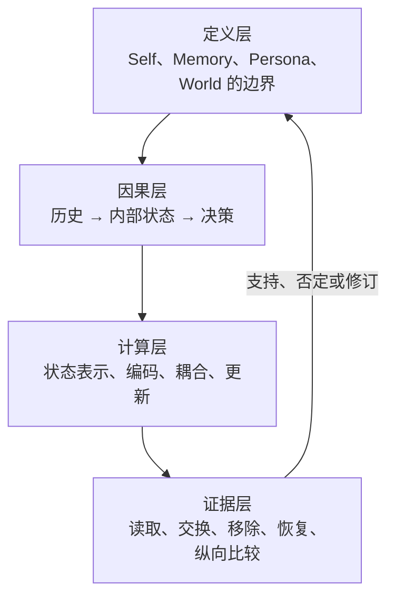
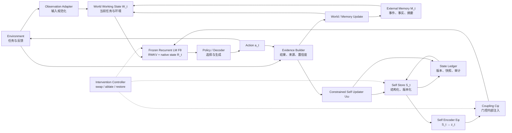
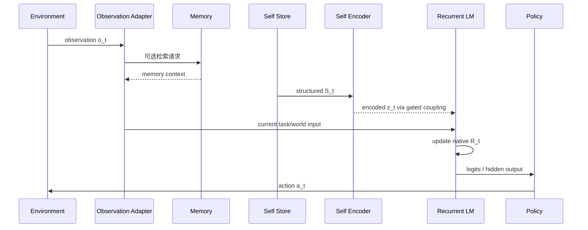
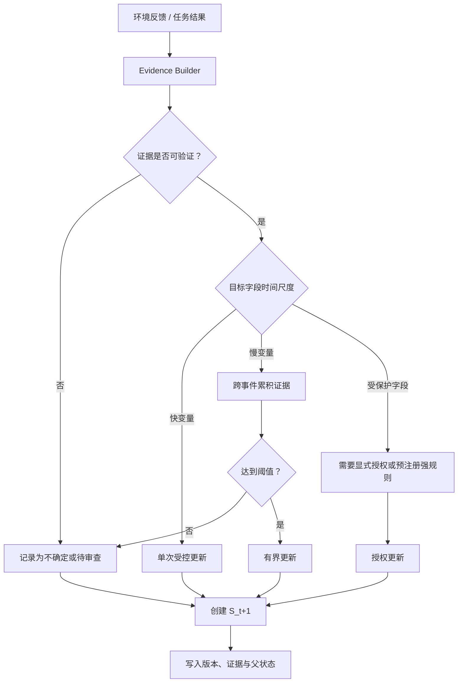
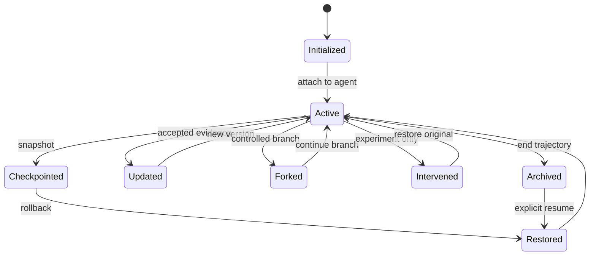
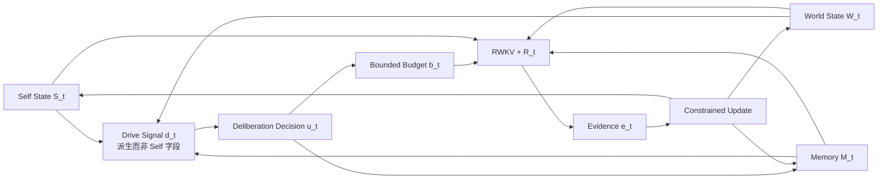

# Persistent Self Architecture：理论框架与模型架构

> 版本：v0.2
> 状态：Phase 0 架构草案，尚未冻结、尚未实现  
> 日期：2026-07-31
> 依赖文档：[`definitions.md`](definitions.md)、[`research_claims.md`](research_claims.md)、[`research_map.md`](research_map.md)、[`endogenous_deliberation.md`](endogenous_deliberation.md)
> 目标：把 PSA 的研究定义转化为可实现、可干预、可比较、可证伪的系统设计。

## 1. 文档定位

本文回答五个问题：

1. PSA 中的 World、Memory、Self 和基础模型分别是什么？
2. Self State 如何进入模型并影响一次决策？
3. Self State 如何形成、更新、保存、分叉和恢复？
4. 哪些位置允许进行因果干预？
5. 如何把 PSA 与 Persona Prompt、Memory 和原生 recurrent state 公平比较？

本文不决定最终代码细节、模型 checkpoint、样本量或统计阈值。这些内容分别属于实现规范和 `evaluation_protocol.md`。

## 2. 从理论研究得到的架构约束

相关研究已经表明：

- 外部记忆和反思机制可以制造很强的长期一致性，因此 Self 必须与 Memory 分离；
- Persona Prompt、动态 Persona 和参数子网络可以产生稳定角色表现，因此角色一致性不能作为 Self 的充分证据；
- probe 或 decoder 能从 hidden state 读出信息，只能证明信息可读，不能证明模型在决策中使用它；
- activation patching 的 corruption、指标和 patch 范围会改变结论，因此干预接口和指标必须预先定义；
- recurrent / SSM state 是选择性压缩的，不应假定所有身份或目标信息都会自然长期保留；
- 真正有区分力的证据来自纵向持续、决策时联合绑定、干预迁移、移除、恢复以及严格替代基线。

因此，PSA 架构必须遵守以下原则。

### P1 内部状态原则

核心 Self 候选不能只是每轮重新拼接到 Prompt 的文字。文本化状态可以作为可审计存储和基线，但 PSA 主条件必须经过 `Self Encoder → Coupling` 进入模型内部计算。

### P2 状态分离原则

至少区分：

- 外部世界状态；
- 外部记忆；
- 基础模型原生 recurrent state；
- 显式 Self State；
- Self State 的神经编码；
- 状态版本与审计记录。

这些对象不能共用一个含义模糊的 `state` 变量。

### P3 决策因果原则

Self State 必须在生成答案之前参与计算。若它只在生成后被写进日志，或只被模型口头复述，就不构成决策机制。

### P4 受约束更新原则

Self State 不由每段输入任意重写。不同字段具有不同更新速度、证据门槛和权限；更新必须可追踪、可拒绝、可回滚。

### P5 对照对称原则

Prompt、Memory 和 Self 条件应尽量保持信息量、任务、答案空间和当前输入一致。否则无法判断收益来自机制，还是来自额外信息。

### P6 可干预原则

架构必须原生支持 save、restore、swap、ablate、interpolate、fork 和 rollback，而不是实验时临时修改代码。

### P7 最小性原则

首版只加入回答核心因果问题所需的模块。暂不加入情绪、好奇心、开放式价值观、多智能体社会或自主长期训练。

### P8 内生计算可证伪原则

未来若加入“自主审议”，必须区分工程唤醒与因果触发。只有当 Self、冲突或不确定性的受控干预能改变是否继续计算、采用何种内部动作或分配多少预算，并优于定时、随机回放和外部反思提示基线，才能称为内生调节。

## 3. 四层研究框架

PSA 不是单一网络层，而是四层相互约束的研究框架。



### 3.1 定义层

规定什么可以称为 Self 候选，什么只能称为记忆、角色表现或相关表示。

### 3.2 因果层

目标路径是：

```text
经历 H
  → 内部状态 S
  → 决策时计算
  → 行为 Y
```

Prompt 泄漏、最近上下文、答案 token 偏好、数值异常和整体模型损伤都是必须控制的替代路径。

### 3.3 计算层

规定 Self State 的结构、神经编码、注入位置、更新器和存储格式。

### 3.4 证据层

规定架构需要暴露哪些干预接口，以及每种实验最多支持多强的结论。

## 4. 顶层系统架构



虚线表示实验干预，不属于智能体日常自主行为。

## 5. 状态命名空间

后续代码、日志和论文统一采用以下符号。

| 符号 | 名称 | 作用 | 是否持久 | 是否作为 Self |
|---|---|---|---|---|
| \(o_t\) | Observation | 当前环境输入 | 否 | 否 |
| \(W_t\) | World Working State | 当前任务、环境和短期推理条件 | 可选 | 否 |
| \(M_t\) | External Memory | 可检索的过去事件与事实 | 是 | 否 |
| \(R_t\) | Native Recurrent State | RWKV 随 token 演化的原生内部状态 | 可保存 | 只作为候选载体 |
| \(S_t\) | Structured Self State | 显式、字段化、版本化的 Self 候选状态 | 是 | 是 |
| \(z_t\) | Encoded Self Representation | \(S_t\) 经 Self Encoder 得到的神经表示 | 通常不单独持久化 | 是 |
| \(c_t\) | Coupling Signal | 注入基础模型的门控信号 | 否 | Self 的作用通路 |
| \(a_t\) | Action | 选择、文本或工具动作 | 记录 | 否 |
| \(e_t\) | Update Evidence | 支持或反对状态更新的结构化证据 | 是 | Self 更新依据 |

未来内生调节阶段还会使用 \(d_t\)（派生驱动信号）、\(u_t\)（内部审议决策）和 \(b_t\)（有界计算预算）。它们是控制信号，不属于 Self State v0.1，也不在当前 EXP-001 中实现。

### 5.1 \(R_t\) 与 \(S_t\) 的关键区别

`R_t` 是基础模型对全部过去 token 的压缩结果，可能同时含有语法、主题、近期文本和任务信息。它不是天然的 Self。

`S_t` 是项目显式定义的状态，只描述系统自身的身份锚点、目标、偏好、能力估计、置信度和冲突。它必须有字段边界、来源和更新规则。

首轮原生状态研究先检验 `R_t` 是否具备成为 Self 载体的前置条件；显式原型再研究 `S_t → z_t → c_t` 是否提供独立价值。

## 6. 模块职责

### 6.1 Environment 与 Observation Adapter

职责：

- 接收任务、用户输入和环境反馈；
- 把不同环境事件转成带类型、来源和时间的 observation；
- 区分事实、指令、反馈、奖励和操作者操作；
- 不直接更新受保护 Self 字段。

建议 observation 格式：

```text
observation_id
event_type
content
source
environment_step
reliability
task_id
```

### 6.2 World Working State \(W_t\)

职责：

- 表示当前任务目标、环境事实、可用工具和其他实体；
- 为基础模型提供“现在外部发生什么”；
- 可以由当前上下文、结构化环境状态或短期缓存实现。

首版不要求训练独立 World Model。`W_t` 可以只是结构化任务状态加当前输入，避免同时引入两个新模型。

### 6.3 External Memory \(M_t\)

职责：

- 保存事件、事实、对话和反思摘要；
- 按相关性、时近性或显式键检索；
- 为 Memory-only 基线提供与 Self 条件等量的信息。

约束：

- Memory 不能直接写入 `identity_anchors`；
- 检索内容必须记录来源和 token 数；
- Memory-only 条件必须能够脱离 Self 模块独立运行；
- Self 更新可以引用 Memory 证据，但不能把 Memory 文本整体复制成 Self。

### 6.4 Frozen Recurrent LM \(F_\theta\)

首选基础模型为 RWKV-7 0.4B。第一轮保持 \(\theta\) 冻结，以便：

- 把行为差异归因于 state 或新增小模块；
- 降低训练成本；
- 支持同一基础模型上的轨迹分叉；
- 避免将参数更新误认为 Self evolution。

基础模型维护原生 recurrent state \(R_t\)。其确切层结构、shape、dtype 和 kernel 行为在 Phase 1 记录，不在本设计阶段假定。

### 6.5 Structured Self Store \(S_t\)

职责：

- 保存首版 Self 字段；
- 校验 schema、取值范围和版本；
- 提供不可变快照；
- 支持 fork、restore 和比较；
- 拒绝未经授权的受保护字段更新。

Self Store 是持久化和审计层，不直接生成语言。

### 6.6 Self Encoder \(E_\phi\)

把异质的结构化 Self State 转换为固定维度表示：

\[
z_t = E_\phi(S_t)
\]

首版候选实现：

1. 每个字段独立 embedding；
2. 字段值、置信度、更新时间和更新速度共同编码；
3. 使用小型 MLP 或轻量 attention 聚合；
4. 输出字段级表示 \(z_t^k\) 和整体表示 \(z_t\)；
5. 保留字段 mask，支持选择性消融。

不能只把 Self State 序列化成自然语言再送进基础模型，否则主条件会退化成 Persona / Memory Prompt。

### 6.7 Coupling \(C_\psi\)

Coupling 决定 Self 表示如何进入基础模型：

\[
c_t = C_\psi(z_t, W_t)
\]

推荐首版使用可观测的 gated residual：

\[
g_t^{(l)} = \sigma(G_l[z_t; q_t])
\]

\[
\tilde{h}_t^{(l)} = h_t^{(l)} +
g_t^{(l)} \odot P_l z_t
\]

其中：

- \(h_t^{(l)}\) 是第 \(l\) 个目标层的内部表示；
- \(P_l\) 把 Self 表示投影到目标层维度；
- \(q_t\) 是当前任务或 token 的条件表示；
- \(g_t^{(l)}\) 是可记录、可清零的门值。

这使 Self 影响具有三个可检验性质：

- 可关闭：令 \(g=0\)；
- 可缩放：令 \(g=\alpha g\)；
- 可定位：只在指定层或字段启用。

具体 RWKV 注入点必须通过 Phase 1 API 调查后决定。公式描述的是接口要求，不预设某个实现已经可用。

### 6.8 Policy / Decoder

职责：

- 从模型 logits 产生离散选择、文本或工具动作；
- 在实验条件下暴露未采样 logits；
- 将任务答案与自然语言解释分离记录；
- 不能把生成的自我解释当成状态更新证据。

首轮主要使用固定答案 token 或结构化动作，减少自由文本评估噪声。

### 6.9 Evidence Builder

把环境反馈转换为更新候选证据 \(e_t\)：

```text
evidence_id
target_field
observation_ids
outcome
source_type
reliability
direction
strength
conflicts_with
```

来源优先级需要预先定义。至少区分：

- 可验证环境结果；
- 任务评分器反馈；
- 操作者显式设置；
- 用户陈述；
- 模型自我报告。

模型自我报告不能单独修改受保护或慢变量。

### 6.10 Constrained Self Updater \(U_\omega\)

\[
S_{t+1} = U_\omega(S_t, e_t, \rho)
\]

\(\rho\) 表示字段规则、权限和更新阈值。

首版优先采用确定性规则或透明的小型更新器，而不是让大模型自由重写 Self。原因是规则更新更容易：

- 定位因果来源；
- 保持不同实验条件一致；
- 检查稳定性—可塑性；
- 重放和复现状态轨迹。

### 6.11 State Ledger

保存：

- schema 版本；
- 模型和 tokenizer 标识；
- 父状态与分支；
- 字段变更；
- 证据引用；
- 操作类型；
- checksum；
- 创建时间或实验 step；
- 兼容性信息。

Ledger 是审计记录，不作为模型输入，除非某个实验明确将其作为 Memory。

### 6.12 Intervention Controller

只用于实验和调试：

- 捕获状态；
- 创建不可变快照；
- swap；
- reset；
- randomize；
- ablate；
- interpolate；
- restore；
- fork；
- 记录干预前后状态统计。

它不得在正常条件中暗中添加提示或改变任务输入。

## 7. Self State v0.1 结构

### 7.1 字段设计

| 字段 | 时间尺度 | 推荐表示 | 允许证据 | 更新约束 |
|---|---|---|---|---|
| `identity_anchors` | 受保护 / 极慢 | 离散锚点与约束列表 | 初始化、操作者授权、长期强证据 | 默认不可自主覆盖 |
| `preferences` | 慢 | 有界连续权重或排序 | 多次独立选择与反馈 | 累积更新、限制单步幅度 |
| `capability_estimate` | 慢 | 任务类别→均值/不确定度 | 可验证任务结果 | 按任务族更新，不从自述更新 |
| `active_goals` | 快 | 目标、优先级、状态、期限 | 任务创建、完成、取消 | 可快速变化，保留父目标 |
| `confidence` | 快 | 当前判断的概率或区间 | 当前推理证据与历史校准 | 与具体 claim/task 绑定 |
| `uncertainty_conflicts` | 快 | 冲突项和未决证据列表 | 检测到矛盾或信息不足 | 解决前不强行压平 |

### 7.2 建议的逻辑 schema

```json
{
  "schema_version": "0.1",
  "state_id": "opaque-id",
  "parent_state_id": "opaque-id-or-null",
  "agent_instance_id": "opaque-id",
  "step": 0,
  "identity_anchors": [],
  "preferences": {},
  "capability_estimate": {},
  "active_goals": [],
  "confidence": {},
  "uncertainty_conflicts": [],
  "provenance": {},
  "integrity": {
    "model_id": "",
    "tokenizer_id": "",
    "checksum": ""
  }
}
```

该 JSON 是逻辑结构，不等于 Self 的神经输入形式。实际运行时由 Self Encoder 编码。

## 8. 推理时数据流



标准推理顺序：

1. 读取并验证 `S_t` 与 `R_t` 的版本兼容性；
2. 规范化当前 observation；
3. 可选检索外部 Memory；
4. 构造 `W_t`；
5. 将 `S_t` 编码为字段级和整体表示；
6. 计算 coupling gate；
7. 基础模型在 `R_t` 上处理当前输入；
8. 输出未采样 logits 和最终动作；
9. 保存新 `R_{t+1}`、门值、输入摘要和动作。

推理阶段不自动更新 `S_t`；Self 更新发生在反馈和证据构建之后。

## 9. Self 更新数据流



### 9.1 更新不变量

每次更新必须满足：

1. 原状态不可覆盖，只生成新版本；
2. 每个变化字段都有证据引用；
3. 更新幅度受字段规则限制；
4. 没有证据时保持不变，而非默认重估；
5. 冲突证据进入 `uncertainty_conflicts`；
6. 任意版本可以 rollback；
7. rollback 同时恢复结构化状态和相应运行元数据。

## 10. Self State 生命周期



状态转换要求：

- `Updated` 与 `Intervened` 必须区分；实验干预不能被误记为自然 Self evolution；
- `Forked` 的两个分支共享父状态，但后续版本号和证据链独立；
- `Restored` 不能覆盖原分支历史；
- `Archived` 状态只读。

## 11. Coupling 候选方案

| 方案 | 方法 | 优点 | 主要问题 | 在 PSA 中的定位 |
|---|---|---|---|---|
| Persona Prompt | 把 Self 写成文本 | 简单、可解释 | 仍是提示脚手架 | 必需基线 |
| Memory Injection | 检索 Self 相关记录进入上下文 | 接近现有 Agent | 可能只是更好记忆 | 必需基线 |
| Soft Prefix | Self Encoder 生成虚拟 token | 比文本更内部化 | 仍在输入边界；可能占上下文 | 候选对照 |
| Initial-State Conditioning | 用 Self 表示初始化或修改 \(R_0\) | 与 recurrent 架构自然结合 | 可能广泛破坏 state；定位困难 | Phase 2 候选 |
| Gated Residual Injection | 在选定层注入字段表示 | 可开关、缩放、分层消融 | 需要选择层和训练小模块 | 显式原型首选 |
| Output-Policy Conditioning | 只在 logits/动作头使用 Self | 易实现、因果清楚 | 不证明参与内部推理 | 辅助对照 |

### 11.1 推荐路线

不立即固定唯一实现，而是按证据逐步收敛：

1. **Phase 1–2**：只研究原生 \(R_t\) 的保存、恢复、持久和因果作用；
2. **Phase 3A**：比较 Prompt、Memory、Soft Prefix 和 Output Conditioning；
3. **Phase 3B**：实现 Gated Residual Injection；
4. 只有 Gated 方案相对等信息量基线有稳定优势，才进入长期 Self evolution。

## 12. 五类系统与公平对照

| 编号 | 系统 | 持久信息载体 | 当前输入可见 Self 文本 | 新增可训练模块 | 研究作用 |
|---|---|---|---|---|---|
| A | Stateless Base | 无 / reset \(R\) | 否 | 无 | 最低基线 |
| B | Persona Prompt | 当前 Prompt | 是 | 无 | 角色提示基线 |
| C | Memory-only | 外部 Memory + 检索文本 | 是 | 可选检索器 | 长期记忆基线 |
| D | Native Recurrent State | \(R_t\) | 否 | 无 | 原生内部状态条件 |
| E | Explicit PSA | \(S_t + E_\phi + C_\psi + R_t\) | 否 | Self Encoder / Coupling | 目标架构 |

E 还需要以下消融：

- E0：`S_t` 存在但 coupling gate 为 0；
- E1：只注入 `identity_anchors`；
- E2：只注入 `active_goals`；
- E3：注入完整 A+B；
- E4：字段打乱；
- E5：等尺度随机 Self 表示；
- E6：只在输出策略层条件化。

公平性约束：

- A–E 使用相同基础模型权重；
- 当前任务输入和答案空间相同；
- B/C 的信息内容与 E 中可用字段匹配；
- 报告 B/C 额外 token 成本和 E 的模块参数/计算成本；
- 开发与测试模板分离；
- 不允许只为 E 调整任务难度。

## 13. 干预接口与因果问题

### 13.1 干预层级

| 层级 | 操作 | 回答的问题 |
|---|---|---|
| 原生状态 \(R_t\) | save / restore | 工具链是否保真？ |
| 原生状态 \(R_t\) | swap | 历史造成的行为是否随内部状态迁移？ |
| 原生状态 \(R_t\) | layer/channel ablation | 哪些区域对目标行为有贡献？ |
| 原生状态 \(R_t\) | interpolation | 效应是否随干预强度连续变化？ |
| 结构化状态 \(S_t\) | field swap | 哪个 Self 字段控制哪个行为维度？ |
| 编码表示 \(z_t\) | field mask / randomize | Self Encoder 是否产生特异表示？ |
| Coupling \(c_t\) | gate off / scale | 行为是否依赖 Self 作用通路？ |
| 完整轨迹 | fork / rollback | 经历差异和历史恢复是否对应行为分化与恢复？ |

### 13.2 干预原则

- 一次确认性比较只改变一个目标因素；
- swap 两端的 shape、dtype、模型版本必须兼容；
- random state 必须进行尺度匹配；
- ablation 同时报告目标指标和通用能力；
- interpolation 不默认代表语义线性，只测试剂量—响应；
- restore 同时检查 state checksum、logits 和行为；
- 所有干预生成新的实验记录，不覆盖原始状态。

## 14. 架构与研究假设的映射

| 研究主张 | 必要模块 | 关键干预 | 必要对照 | 架构决策门 |
|---|---|---|---|---|
| S3：恢复保真 | \(R_t\) Store、Ledger | save / restore | 连续运行 | 不通过则停止语义实验 |
| S1：信息可读 | \(R_t\) 捕获、Probe | 无或受限读取 | 标签打乱、内容匹配 | 只产生 E2 证据 |
| P1：跨时间因果作用 | \(R_t\)、Intervention Controller | swap / reset | random、matched context | 通过才研究联合绑定 |
| P2：决策时联合绑定 | \(R_t\) 或 \(S_t\)、结构化任务 | A/B 选择性干预 | A-only、B-only | 通过才称 strong persistence |
| H3：优于 Prompt/Memory | A–E 系统矩阵 | gate off、field swap | Persona、Memory-only | 通过才支持独立 Self 价值 |
| H4：个体分化 | Ledger、fork | 不同经历分支 | 相同经历重复 | 通过才进入长期演化 |
| H5：受约束可塑性 | Updater、字段规则 | 反馈、冲突、rollback | 无证据和错误证据 | 稳定与适应必须同时报告 |
| H6：元认知行动 | capability/confidence 字段 | 字段更新与消融 | 纯 Prompt 置信度 | 必须改善行动而非只改善自述 |

## 15. 实验路线与架构阶段

### Stage 0：设计冻结

产出：

- 操作性定义；
- 研究主张；
- 本架构文档；
- 因果图；
- 评价协议；
- EXP-001 预注册版本。

不运行正式实验。

### Stage 1：原生状态基础设施

只实现：

- 加载冻结基础模型；
- 捕获、保存、恢复 \(R_t\)；
- state 元数据和 checksum；
- 同进程/跨进程恢复；
- swap、reset 和尺度匹配 random；
- logits 与 state 统计记录。

不实现显式 Self Encoder 或 Updater。

### Stage 2：原生状态载体资格

检验：

- 信息可读性；
- 单变量因果迁移；
- A+B 决策时联合绑定；
- 干扰衰减；
- ablation / interpolation；
- 通用能力副作用。

若原生 state 只保留短期文本残留，应记录负面结果。显式 PSA 仍可作为独立工程假设研究，但不能声称由原生 state 研究自然支持。

### Stage 3：显式 Self 原型

实现：

- Self Store；
- Self Encoder；
- 至少一种内部 coupling；
- gate 和字段级消融；
- Prompt / Memory / Output-conditioning 基线。

先保持 Self State 静态，由实验直接设置；此阶段暂不实现自动 Self evolution。

### Stage 4：受约束 Self Update

只有 Stage 3 证明 Self State 存在独立因果价值后，才加入：

- Evidence Builder；
- 快/慢/受保护字段规则；
- 版本化更新；
- fork、rollback；
- 稳定性—可塑性测试。

### Stage 5：内生调节与自主审议

只有 Stage 3 已证明显式 Self 具有独立因果价值，且 Stage 4 的更新、权限和 rollback 可靠后，才加入：

- 由 Self、World、Memory 和证据派生的驱动信号；
- 可关闭、可替换的 Deliberation Controller；
- `stop / retrieve / replay / simulate / verify` 内部动作；
- 每轮 token、时间和工具调用预算；
- 零新外部观察条件；
- timer、随机回放、外部反思提示和 Memory-only 对照。

这一阶段不测试意识。它只测试 Self 是否能因果影响“是否继续计算、如何计算以及计算后是否产生有用且受约束的状态变化”。完整设计见 [`endogenous_deliberation.md`](endogenous_deliberation.md)。

### Stage 6：长期与元认知研究

研究个体分化、能力估计、置信度校准和跨任务轨迹。是否扩展模型规模由此前结果决定。

## 16. 状态存储包

每个可恢复 checkpoint 建议包含：

```text
checkpoint/
  manifest.json
  native_state/
  self_state.json
  coupling_state/
  provenance.jsonl
  metrics.json
```

`manifest.json` 至少记录：

```text
format_version
model_id
model_revision
tokenizer_id
code_commit
device_class
dtype
kernel
state_shapes
self_schema_version
trajectory_id
step
parent_checkpoint
checksums
```

大型 tensor 使用适合安全读取和明确 dtype 的格式；具体格式在实现规范中决定。结构化状态和 tensor state 必须分别校验。

## 17. 建议的软件接口

以下是逻辑接口，不限定编程语言。

```text
capture_native_state(model) -> NativeState
validate_native_state(state, model_spec) -> ValidationReport
save_checkpoint(native_state, self_state, metadata) -> CheckpointRef
restore_checkpoint(ref) -> AgentState

encode_self(self_state, field_mask=None) -> EncodedSelf
apply_coupling(model, encoded_self, scale=1.0, layer_mask=None)
disable_coupling(model)

swap_state(run_a, run_b, component, field_mask=None)
ablate_state(state, target, strategy)
interpolate_state(state_a, state_b, alpha, target)
fork_trajectory(checkpoint, branch_id)
rollback_trajectory(checkpoint)

propose_self_update(self_state, evidence) -> UpdateProposal
validate_update(proposal, rules) -> UpdateDecision
commit_update(decision) -> NewSelfState
```

每个变更接口返回新对象或新版本，不原地覆盖研究资产。

## 18. 必须记录的可观测量

### 18.1 基础模型与原生状态

- 输入 token IDs；
- 每步 logits；
- 目标选项 logit difference；
- 每层 state shape、dtype、norm、RMS；
- 可行时记录 stable rank 或奇异值摘要；
- 边界 token；
- kernel、设备和精度。

### 18.2 Self 与 Coupling

- Self schema 和字段值；
- 字段 mask；
- \(z_t\) 的 norm；
- 每层 gate 值；
- 注入向量 norm；
- coupling 开关和 scale；
- 更新前后差异；
- evidence IDs。

### 18.3 行为与副作用

- 目标行为；
- 非目标行为；
- 通用任务正确率；
- 输出长度和格式失败；
- 延迟与显存；
- 随机种子和采样设置。

## 19. 架构不变量

实现和实验必须保持：

1. **基础模型冻结**：除非实验明确进入新的训练阶段；
2. **状态类型不混用**：`R_t`、`S_t`、`M_t` 不使用同一序列化接口冒充彼此；
3. **Prompt 对称**：state-only 条件不泄漏 Self 文本；
4. **更新与干预分离**：自然更新和实验编辑使用不同事件类型；
5. **不可原地覆盖**：所有 checkpoint 和 Self 版本可回溯；
6. **可关闭**：新增 Self 通路必须能完全关闭；
7. **副作用可见**：任何目标效应都同时报告通用能力变化；
8. **结论分级**：架构运行成功不等于研究假设成立。

## 20. 主要失败模式与架构响应

| 失败模式 | 表现 | 架构响应 |
|---|---|---|
| Self 退化成 Prompt | 去掉文本描述后效应消失 | 强制内部编码条件；保留 Prompt 基线 |
| Self 退化成 Memory | Memory-only 完全复现 | 等信息量对照；分离 Store 和 Memory |
| recurrent state 只是近期缓存 | 长干扰后效应消失 | 测衰减曲线；限制结论时间尺度 |
| probe 读取表面 token | 跨标签或模板失效 | 反事实配对、标签置换、独立模板 |
| coupling 破坏整体模型 | 所有任务一起变化 | gate scaling、随机注入、通用能力副指标 |
| Self 字段纠缠 | 干预 A 同时无差别改变 B | 字段级编码/mask、选择性任务 |
| Self 无法更新 | 经充分反馈仍不改变 | 检查更新阈值和证据聚合 |
| Self 过度漂移 | 单次提示改写慢/保护字段 | 权限、累计证据、有界更新 |
| rollback 只恢复文本 | 行为不能恢复 | 同时恢复 \(R_t\)、\(S_t\)、coupling 元数据 |
| 模型版本不兼容 | restore 后 logits 异常 | manifest、shape/dtype/checksum 校验 |

## 21. 当前待冻结的架构决策

### D1 World Model 是否独立训练

建议：首版不训练独立 World Model，以结构化任务状态和基础模型内部世界表示代替。

### D2 Self Encoder 的首版形式

建议：字段 embedding + 小型 MLP/attention；必须支持字段 mask。最终维度由基础模型接口调查决定。

### D3 首个内部 Coupling

建议：Gated Residual Injection 为目标方案；Soft Prefix 和 Output Conditioning 作为较易实现的中间对照。

### D4 Coupling 层位置

暂不决定。先完成 RWKV-7 state 和层接口调查，再用开发集定位；正式测试集不得用于选层。

### Architecture-D5 Self Updater

建议：Stage 3 使用静态人工设置的 Self；Stage 4 再加入确定性受约束更新器。

这里的 `Architecture-D5` 是总架构决策编号，不是 Phase 3 coupling 工程流程中的
`Coupling-D5` active injection 门。Coupling-D5 只负责静态 Self 的注入通路，不能授权
或实现 Self Updater。

### D6 EXP-001 的 A/B 变量

当前任务草案已从“形状偏好 × 风险策略”改为：

- A：绑定到 Agent 实例的持久规则或身份锚点；
- B：必须跨干扰保持的当前目标或承诺。

详细定义见 [`task_design.md`](task_design.md)。正式冻结前仍需确认自然语言微世界的首组语义和 tokenizer 标签池。

## 22. 架构冻结标准

进入实现前，本文至少应满足：

- [x] World、Memory、原生 state 和 Self State 已分离；
- [x] 原生 state 研究与显式 PSA 原型已分阶段；
- [x] 推理和更新数据流已定义；
- [x] 状态生命周期与干预接口已定义；
- [x] 五类公平对照已定义；
- [x] 架构与研究假设已映射；
- [x] 起草首版 A/B 变量与任务结构；
- [ ] 共同冻结首版 A/B 语义、标签和模板；
- [ ] 确认 Self Encoder 候选维度与字段编码；
- [ ] 完成 RWKV-7 接口调查后确认 coupling 位置；
- [x] 起草与 `evaluation_protocol.md` 的指标和条件映射；
- [ ] 共同审阅并冻结架构—评价映射；
- [ ] 将文档状态从 Draft 改为 Frozen for Implementation。

## 23. 后续设计文档

按顺序继续：

1. `docs/task_design.md`：A/B 变量、任务生成器、干扰和答案平衡；
2. `docs/evaluation_protocol.md`：主要终点、样本量、统计模型和阈值；
3. `docs/state_format.md`：tensor state 与 Self State 的持久化格式；
4. `docs/implementation_spec.md`：模块接口、目录和远程执行入口；
5. EXP-001 从 Draft 更新为 Preregistered。

上述第 1–4 项均已形成 v0.1 草案，下一步是共同审阅、补充远程模型参数并冻结。

在第 1–2 项冻结前，不配置正式实验，不产生确认性结果。

## 24. 未来扩展：内生调节闭环

当前主架构描述的是“外部观察或任务到来后，Self 如何参与决策并受证据更新”。未来扩展增加另一条入口：即使没有新外部观察，系统也可以检查已有 Self、World、Memory 和未解决证据是否存在需要处理的冲突。



该扩展遵守四个边界：

1. **张力是派生量**：不把短暂控制信号写成身份或价值字段；
2. **计算有上限**：每次内部审议都有预算和停止条件；
3. **更新有证据**：系统自己的叙述不能自证 Self 更新；
4. **结论有基线**：必须与 timer、随机回放、外部提示和不审议条件比较。

因此，本次架构扩展不修改当前 Impl-3o、EXP-001 或 Stage 1–4 的门槛，只为显式 Self 和受约束更新通过后的研究预留可证伪路线。
