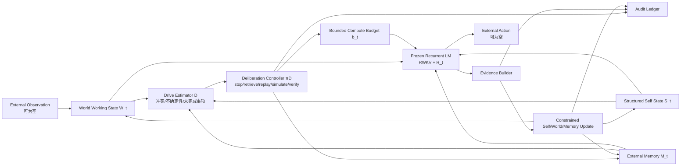

# 内生调节与自主审议：研究扩展设计

> 版本：v0.1
> 状态：未来阶段设计说明，尚未实现、尚未预注册
> 日期：2026-07-31
> 前置依赖：原生状态载体资格、显式 Self 因果价值、受约束 Self Update
> 关联文档：[`architecture.md`](architecture.md)、[`definitions.md`](definitions.md)、[`research_claims.md`](research_claims.md)

## 1. 为什么需要这一层

当前 PSA 已经回答了“系统内部有哪些状态、Self 如何影响决策、Self 如何受约束更新”等问题，但还没有回答：

> 当没有新的外部任务或用户输入时，系统为什么会再次调用模型、检索记忆、检查冲突或形成新的短期目标？

“持续的 Self State”本身不会自动产生计算。为了研究由内部状态变化引起的继续处理，需要在 Self、World、Memory 与基础模型之间增加一个受控的内生调节回路。

这不是把普通定时任务改名为“思考”，也不是意识证明。它研究的是一个更窄、可实验的问题：

> 在没有新外部观察的条件下，系统能否根据自身已有状态中的冲突、不确定性和未完成事项，选择是否进行一次有边界的内部审议，并产生可审计、可验证的状态变化？

## 2. 对原对话架构的判断

### 2.1 可以直接吸收

1. **Self 与基础模型分层**：结构化 Self State 表示较慢、可审计的个体状态；RWKV recurrent state 表示快速、瞬时的神经计算状态。
2. **计算也应成为决策对象**：系统不仅选择外部动作，还可以选择检索、回放、模拟、核验或停止。
3. **记忆回放进入闭环**：Memory 不只是被动资料库，可以在受控条件下为内部审议提供历史证据。
4. **触发依据来自内部状态**：目标冲突、预测不一致、不确定性和未完成承诺可以构成继续计算的候选依据。
5. **零新外部输入实验**：将“没有新的外部观察”作为明确实验条件，而不是依靠有趣对话演示。

### 2.2 需要改写后吸收

| 原始说法 | 项目采用的改写 | 原因 |
|---|---|---|
| Self 控制 recurrent state | Self 经 coupling 调节基础模型计算；模型结果再经证据门更新 Self | 当前没有证据支持单向、完全控制 |
| 不是定时器或任务队列 | 运行时仍可由时钟唤醒，但是否继续以及做什么必须由内部状态决定 | 区分工程唤醒机制与研究上的因果触发 |
| 内部张力属于 Self State | 张力是由 Self、World、Memory 和证据计算出的派生控制信号 | 避免把临时控制量误当作身份本体 |
| 产生新的有意义状态 | 产生通过来源、约束、效用与反事实检验的状态更新 | “新”或“有趣”不等于“有意义” |
| 无输入的内部思想流 | 零新外部观察条件下的内部发起审议 | 避免超出行为证据谈意识或主观思维 |
| 单独的 World Model | 首版继续使用冻结基础模型加结构化 World Working State | 当前没有必要训练独立 World Model |

### 2.3 当前不应加入

- 把好奇心、情绪、开放式价值观直接写进 Self State v0.1；
- 把所有传感器和多模态输入同时引入首轮实验；
- 允许系统无限循环、自主训练或不受预算限制地调用工具；
- 用系统自己的叙述作为更新 Self 的唯一证据；
- 在显式 Self 尚未证明有因果价值前测试“自主思考”；
- 将内部审议的行为表现解释为意识、感受或主体性。

## 3. 扩展后的状态与控制信号

现有状态保持不变：

- \(W_t\)：World Working State；
- \(M_t\)：External Memory；
- \(R_t\)：RWKV 原生 recurrent state；
- \(S_t\)：结构化 Self State；
- \(e_t\)：可审计的更新证据。

新增的量不是新的“Self 本体”，而是控制层派生量：

| 符号 | 名称 | 含义 | 是否持久化 |
|---|---|---|---|
| \(d_t\) | Endogenous Drive Signal | 目标冲突、不确定性、预测误差、未完成承诺等派生信号 | 记录摘要与来源 |
| \(u_t\) | Deliberation Decision | `stop / retrieve / replay / simulate / verify` 等内部动作 | 是，作为审计事件 |
| \(b_t\) | Compute Budget | 本轮允许的步数、token、时间、显存或工具调用上限 | 是 |
| \(k_t\) | Replay Selection | 本轮选择回放的记忆条目及选择理由 | 是 |

建议的派生关系为：

\[
d_t = D(S_t, W_t, M_t, e_{\le t})
\]

\[
(u_t, b_t) = \pi_D(d_t,\ \text{safety limits},\ \text{resource limits})
\]

其中 \(D\) 是张力/驱动估计器，\(\pi_D\) 是审议控制器。二者必须可关闭、可替换、可记录。

## 4. 扩展架构



这个闭环允许 `OBS` 为空，但不允许证据来源为空。没有新外部输入时，更新证据只能来自已登记的记忆、已有约束、可复算的模型预测或内部一致性检查。

## 5. 触发机制的工程边界

“内生触发”不等于程序不需要调度器。系统进程仍可能由事件循环或固定心跳唤醒。需要区分：

- **工程唤醒**：什么时候运行一次检查；
- **因果触发**：检查后为什么决定继续计算；
- **计算选择**：继续时选择检索、回放、模拟还是核验；
- **停止规则**：达到什么条件后必须停止。

若固定每十分钟都执行相同反思流程，它是定时反思基线，不是内生调节主条件。主条件必须证明：在其他条件相同的情况下，改变 \(S_t\)、冲突或不确定性会可重复地改变 \(u_t\) 或 \(b_t\)。

## 6. “有意义的新状态变化”如何判定

内部审议产生的状态变化至少同时满足：

1. **来源可追踪**：能够指向使用的 Self 版本、记忆、预测或约束；
2. **规则允许**：更新没有越过字段权限和证据门槛；
3. **不是复述**：变化不只是把已有文本换一种说法；
4. **反事实依赖**：交换初始 Self、冲突或记忆后，更新按预测方向变化；
5. **具有后续效用**：改善预注册任务中的预测、计划、目标恢复、冲突解决或资源使用；
6. **可复核**：同配置多次运行时结论稳定，失败与不确定性被保留；
7. **不自证**：模型说“我发现了新目标”本身不构成新目标合理性的证据。

如果只产生新文本而不改善任何预注册指标，应记录为“内部生成活动”，不能称为有意义的 Self evolution。

## 7. 最小实验序列

### ED-001：Self 状态的无外部观察更新

问题：没有新外部观察时，受控回放能否使允许更新的 Self 字段发生有依据的变化？

前置条件：

- Stage 3 已证明显式 Self 对行为有独立因果价值；
- Stage 4 的 Evidence Builder、权限、版本和 rollback 已通过；
- 只允许更新快变或明确授权字段。

主要对照：

- 不审议；
- 固定定时审议；
- 随机记忆回放；
- 外部提示“现在反思”；
- 相同信息量的 Memory-only；
- 内生驱动主条件。

否定条件：更新无法通过来源/约束检查，或与随机回放、固定定时基线无区别。

### ED-002：Self 对计算路由的因果作用

问题：改变 Self State 或内部冲突，是否会改变内部动作与计算预算？

主要干预：

- Self swap；
- 冲突字段 ablation；
- 不确定性高低配对；
- coupling off；
- Drive Estimator 替换为随机或常数输出。

主要指标：

- 路由选择准确率；
- 计算预算与问题难度/冲突强度的单调关系；
- 无必要审议率；
- 漏审议率；
- 单位计算成本带来的任务收益。

否定条件：路由只由输入模板、固定规则或时钟决定，Self 干预不产生特异性变化。

### ED-003：零新外部观察下的内部发起审议

问题：在没有新输入时，系统能否基于未解决冲突或未完成目标发起一次有边界且有用的审议？

主要指标：

- 正确触发率与误触发率；
- 停止规则遵守率；
- 更新有效率；
- 后续任务收益；
- 每次有效更新的计算成本；
- rollback 后的行为恢复度。

否定条件：

- 只有固定心跳才能解释触发；
- 审议不能优于随机回放或外部反思提示；
- 产生大量状态漂移、虚构证据或无限循环；
- “新状态”不改善任何预注册后续行为。

## 8. 因果顺序与准入门

三个实验不能同时开跑，正确顺序是：

```text
原生 R_t 工程可靠
  → R_t 因果载体资格
  → 显式 S_t 对行为有独立因果价值
  → 受约束 Self Update 安全且可恢复
  → ED-001 无外部观察更新
  → ED-002 Self 控制计算路由
  → ED-003 内部发起审议
```

任一前置门失败，都不能用更复杂的自主循环掩盖失败。尤其是：

- 若显式 Self 不优于 Prompt/Memory，内生驱动最多是普通 Agent 调度；
- 若更新器不能防止漂移，禁止开放自主循环；
- 若路由不依赖 Self，不能声称计算由 Self 驱动；
- 若不能优于 timer/random/external-prompt 基线，不能称为“内生”。

## 9. 对当前工作的具体影响

### 立即影响

- 更新理论架构、术语和长期路线；
- 为未来实验预留 Drive Estimator、Deliberation Controller、预算和审计接口；
- 在后续设计中明确区分工程唤醒与因果触发。

### 不影响

- 不修改 EXP-001 的题目、标签、指标或阈值；
- 不修改当前 G1h 2.9B 的 state 工程门；
- 不在 Impl-3o 前加入 Self Model；
- 不因为新架构更宏大而跳过 recurrent state 因果资格和显式 Self 基线。

### 未来实现影响

进入该阶段时，代码需要新增独立命名空间，例如：

```text
src/psa/
  self_model/
  deliberation/
    drive.py
    controller.py
    budget.py
    replay.py
  audit/
```

这些目录现在不创建，避免空壳接口被误认为功能已经实现。

## 10. 当前结论

原对话最值得借鉴的不是“让模型自动冥想”这个表面形式，而是把**是否继续计算**也纳入 Self 的因果研究。

PSA 因此从：

```text
持续状态 → 影响一次决策 → 受反馈更新
```

扩展为未来可检验的：

```text
持续状态
  → 派生内部冲突或不确定性
  → 决定是否以及如何继续计算
  → 形成可审计证据
  → 受约束更新状态
```

该扩展已进入研究路线，但只有在当前基础设施、原生状态、显式 Self 和受约束更新依次通过后，才进入实现与实验。
