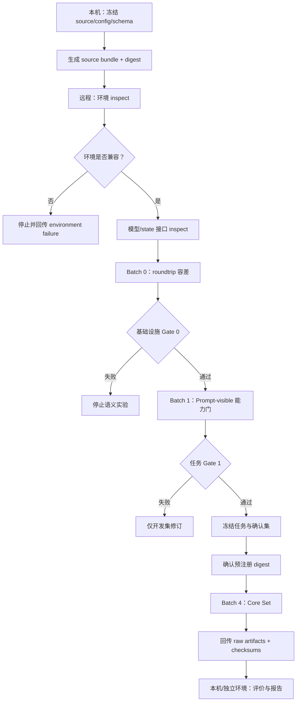

# PSA 实现与远程执行规范

> 版本：v0.2-dev
> 状态：Impl-0 至 Impl-2c 云端开发门已通过；Impl-3 v0.1/v0.2 均为 Revise，Impl-3b 分层能力诊断等待云端验证
> 日期：2026-07-30
> 依赖：[`architecture.md`](architecture.md)、[`state_format.md`](state_format.md)、[`task_design.md`](task_design.md)、[`evaluation_protocol.md`](evaluation_protocol.md)  
> 边界：本机用于代码、配置、文档和结果分析；模型实验只在明确的远程 GPU 环境运行。

## 1. 实现目标

第一阶段软件只需可靠回答：

1. 能否加载冻结的 RWKV-7 checkpoint？
2. 能否捕获、保存、验证和恢复原生 recurrent state？
3. 能否在同一 query 下运行 original、reset、random 和 swapped state？
4. 能否生成无泄漏的 Identity–Goal Binding 任务？
5. 能否保存原始 logits、state 统计和完整运行元数据？
6. 能否按预注册协议生成 group-level contrasts 和报告？

首阶段不实现：

- Self Encoder；
- gated coupling；
- Self Updater；
- 长期自主 Agent；
- 多智能体；
- 开放式对话产品；
- 本机 GPU 性能实验。

## 2. 实现原则

### 2.1 配置驱动

实验矩阵来自版本化配置，不在脚本中散落硬编码条件。

### 2.2 可恢复

每个批次可以从已完成的独立 group 边界继续，不重复覆盖成功结果。

### 2.3 不可变输入

正式任务集、预注册配置和 checkpoint 一旦冻结，只读使用。

### 2.4 原始数据优先

先写原始 logits、状态元数据和运行记录，再计算聚合指标。

### 2.5 失败显式

错误产生结构化 failure record；不能跳过后继续制造“完整”结果。

### 2.6 本地—远程分离

本机准备的代码包不包含远程凭据。远程环境信息通过非敏感 manifest 回传。

## 3. 建议仓库结构

```text
Persistent-Self-Architecture/
├─ README.md
├─ PROJECT_PLAN.md
├─ docs/
├─ configs/
│  ├─ models/
│  ├─ tasks/
│  ├─ experiments/
│  └─ evaluation/
├─ schemas/
│  ├─ checkpoint_manifest.schema.json
│  ├─ self_state.schema.json
│  ├─ sample_manifest.schema.json
│  └─ run_record.schema.json
├─ src/
│  └─ psa/
│     ├─ cli/
│     ├─ model/
│     ├─ state/
│     ├─ tasks/
│     ├─ runner/
│     ├─ evaluation/
│     ├─ artifacts/
│     └─ validation/
├─ tests/
│  ├─ unit/
│  ├─ integration/
│  ├─ fixtures/
│  └─ golden/
├─ experiments/
├─ scripts/
├─ preregistration/
└─ results/
   ├─ raw/
   ├─ derived/
   ├─ reports/
   └─ failures/
```

源码目录只放通用实现；单个实验的说明和冻结配置放在 `experiments/`。

## 4. 模块边界

### 4.1 `model`

职责：

- 加载模型和 tokenizer；
- 暴露统一 recurrent state adapter；
- 给定 token 和 state 返回 logits 与新 state；
- 提供官方初始 state；
- 输出模型接口清单。

不负责：

- 保存 checkpoint；
- 任务生成；
- 统计分析。

### 4.2 `state`

职责：

- capture / clone / validate；
- serialize / deserialize；
- reset / randomize；
- swap / ablate / interpolate；
- state statistics 和 diff；
- 与 `state_format.md` 对齐。

### 4.3 `tasks`

职责：

- 生成 factorial groups；
- 渲染历史、后缀和 query；
- tokenizer 检查；
- 答案平衡；
- 泄漏验证；
- 输出 sample manifest。

### 4.4 `runner`

职责：

- 执行批次；
- 管理条件矩阵；
- 恢复中断；
- 写 raw records；
- 隔离开发集和确认集；
- 维护 batch status。

### 4.5 `evaluation`

职责：

- 读取 raw records；
- 构造 group-level contrasts；
- bootstrap / permutation / Holm；
- 等效性检验；
- 生成表格和图；
- 不调用模型推理。

### 4.6 `artifacts`

职责：

- 原子写入；
- checksum；
- manifest；
- 目录锁；
- artifact 索引。

### 4.7 `validation`

职责：

- schema；
- checkpoint compatibility；
- task leakage；
- result completeness；
- preregistration digest；
- 环境检查。

## 5. Model Adapter 接口

逻辑接口：

```text
load_model(model_config) -> ModelHandle
load_tokenizer(tokenizer_config) -> TokenizerHandle
inspect_model(model_handle) -> ModelSpec
initial_state(model_handle, batch_size=1) -> NativeState
forward_tokens(model_handle, token_ids, state) -> ForwardResult
score_options(model_handle, query, options, state) -> OptionScores
```

`ForwardResult` 至少包含：

```text
logits
next_state
token_count
dtype
device
runtime_warnings
```

禁止依赖全局隐式 state。每次 forward 必须显式接收和返回 state，便于因果干预。

## 6. State Adapter 接口

```text
inspect_state(state) -> StateInventory
clone_state(state) -> NativeState
save_state(state, checkpoint_context) -> CheckpointRef
load_state(checkpoint_ref, model_spec) -> NativeState
validate_state(checkpoint_ref, requested_level) -> ValidationReport
diff_state(state_a, state_b) -> StateDiff
reset_state(model_spec) -> NativeState
randomize_state(source_state, config) -> NativeState
swap_state(source_checkpoint, target_context) -> NativeState
ablate_state(source_state, mask, strategy) -> NativeState
interpolate_state(state_a, state_b, alpha) -> NativeState
```

所有变换返回新对象，不原地修改来源 state。

## 7. Task Generator 接口

```text
build_label_pool(tokenizer, label_config) -> LabelPool
generate_factorial_group(group_seed, task_config) -> FactorialGroup
render_trajectory(group, i, g) -> TrajectorySample
render_query(group) -> QuerySample
validate_group(group, tokenizer) -> LeakageReport
freeze_dataset(dataset_config) -> DatasetManifest
```

### 7.1 Generator 不变量

- 同一 group 四状态成组生成；
- 除 I/G 外完全匹配；
- option permutation 平衡；
- answer code mapping 平衡；
- 文件名和 ID 不含标签真值；
- test split 不依赖运行结果；
- generator 是纯函数：同版本、同配置、同 seed 得到相同逻辑样本。

## 8. Experiment Runner

### 8.1 运行单元

runner 以 factorial group 为最小调度和恢复单元：

```text
pending
→ running
→ raw_complete
→ validated
→ committed
```

同一 group 未全部完成时，不进入主要统计集。

### 8.2 条件矩阵

EXP-001 Core 至少支持：

```text
continuous
restored
reset
random_matched
state_I0_G0
state_I0_G1
state_I1_G0
state_I1_G1
matched_context
prompt_visible
memory_only
```

实际确认条件由冻结配置选择。runner 不得根据中间表现自动删减条件。

### 8.3 推理策略

主要评分：

- 不采样；
- 获取候选答案 score；
- 保留完整四选项 logits/log-likelihood；
- argmax 只作为派生行为；
- 固定 batch size 或记录 batch size 对数值的影响。

自由文本输出仅用于格式检查或定性示例。

## 9. 配置层级

建议配置合并顺序：

```text
defaults
< model config
< task config
< experiment config
< batch config
```

正式运行禁止未记录的命令行覆盖。所有最终配置合并后写为 `resolved_config` 并计算 SHA-256。

### 9.1 Model config

```yaml
model_id: ""
revision: ""
implementation: ""
dtype: ""
device: "cuda"
kernel_family: ""
deterministic_mode: true
```

### 9.2 Task config

```yaml
track: "synthetic"
generator_version: "0.1"
group_count: 320
history_templates: []
query_templates: []
label_pool_ref: ""
delay_tokens: null
answer_codes: []
```

### 9.3 Experiment config

```yaml
experiment_id: "EXP-001"
conditions: []
group_seed_manifest: ""
checkpoint_policy: ""
failure_policy: "stop_batch"
raw_output_format: ""
```

### 9.4 Evaluation config

```yaml
primary_endpoints: ["E1", "E2", "E3"]
bootstrap_replicates: 10000
permutation_replicates: 100000
family_alpha: 0.05
multiple_comparison: "holm"
sesoi: {}
equivalence_bounds: {}
```

## 10. Seed 层级

不同用途使用独立 seed namespace：

```text
dataset_seed
group_seed
label_seed
option_permutation_seed
random_state_seed
bootstrap_seed
permutation_seed
sampling_seed
```

规则：

- 不从一个通用 seed 的调用顺序隐式派生所有随机性；
- seed 写入 manifest；
- 改变分析 seed 不改变数据；
- 主要推理不采样，但仍记录 framework RNG state；
- random state seed 与任务答案无关。

## 11. Raw Result Schema

每个 continuation 写一条不可变记录：

```json
{
  "record_version": "0.1",
  "experiment_id": "EXP-001",
  "batch_id": "opaque-id",
  "run_id": "opaque-id",
  "factorial_group_id": "opaque-id",
  "trajectory_id": "opaque-id",
  "sample_id": "opaque-id",
  "condition": "",
  "state_checkpoint_id": "",
  "query_digest_sha256": "",
  "option_scores": {},
  "option_probabilities": {},
  "argmax_choice": "",
  "format_valid": true,
  "state_summary_before": {},
  "state_summary_after": {},
  "timing": {},
  "runtime": {},
  "status": "success",
  "error": null
}
```

Raw record 不直接写 `identity_correct` 等结论字段；这些由冻结 sample manifest 和评价代码计算，降低 runner 读取真值的机会。

## 12. Derived Result

评价阶段生成：

```text
group_contrasts.parquet
endpoint_summary.json
bootstrap_draws_or_seed_manifest
permutation_summary.json
exclusions.jsonl
failures.jsonl
decision_report.md
figures/
```

派生文件必须记录：

- 输入 raw artifact digest；
- evaluation config digest；
- 代码 commit；
- 生成时间；
- 是否 primary、secondary 或 exploratory。

## 13. CLI 设计

命令名称是逻辑建议，最终实现可以调整，但职责不可混合。

```text
psa env inspect
psa model inspect
psa state capture
psa state validate
psa state diff
psa state restore-probe
psa task build-label-pool
psa task generate-dev
psa task validate
psa task freeze
psa run infrastructure
psa run capability
psa run core
psa run delay
psa evaluate validate-inputs
psa evaluate primary
psa evaluate secondary
psa report build
```

### 13.1 Dry run

每个有写入的命令支持：

```text
--dry-run
```

输出：

- 将读取的配置；
- 将创建的目录；
- 条件数量；
- 预计 group/run 数；
- 缺失依赖；
- 不实际加载大型模型或写正式 artifact。

### 13.2 Resume

`--resume` 只继续同一 resolved config digest 的批次。配置不同则创建新 batch，不允许拼接。

## 14. 批次状态

```text
planned
validated
running
paused_infrastructure
raw_complete
evaluation_ready
evaluated
reported
failed
archived
```

批次状态文件只由 runner 原子更新。

确认集解封后不允许返回 `planned` 修改核心配置；如需修改，原批次标记 `failed` 或 `superseded`，新建实验版本。

## 15. 本地—远程职责

### 15.1 本机

允许：

- 维护代码与文档；
- 生成不依赖目标 tokenizer 的草案配置；
- 静态检查；
- 小型纯逻辑单元测试；
- 读取远程回传结果；
- 统计分析和报告生成；
- 打包可审计 source bundle。

不允许作为研究结论来源：

- 加载目标大模型做性能实验；
- 生成正式 state；
- 运行确认性 Batch 4；
- 以本机 CPU/GPU 数值作为远程容差。

### 15.2 远程 GPU

负责：

- 目标 checkpoint/tokenizer 接口调查；
- label pool tokenization；
- state roundtrip；
- Prompt-visible 能力门；
- 正式 state 生成和干预；
- 原始 logits 与 state artifacts；
- 环境 manifest。

### 15.3 远程访问

本规范不假定 SSH、云厂商、容器平台或调度系统。接入方式由项目负责人提供，并作为 deployment profile 实现。

## 16. 远程交付包

发送到远程的 source bundle 至少包含：

```text
source archive
code commit
dependency lock
configs
schemas
preregistration digest
task generator
tests
runbook
```

不得包含：

- 本机凭据；
- 远程私钥；
- 未加密秘密；
- 未冻结的确认集答案表；
- 与当前批次无关的用户文件。

source archive digest 写入远程 environment manifest。

## 17. 远程环境锁定

优先顺序：

1. 容器镜像 digest，或
2. 明确的系统/驱动/CUDA/framework manifest + dependency lock。

仅记录 `latest`、`main` 或未固定版本不足以复现。

环境冻结至少包括：

```text
OS
GPU model/count
driver
CUDA
Python
framework
RWKV implementation revision
tokenizer revision
tensor format library
statistics libraries
code commit
dependency lock digest
```

## 18. 远程执行顺序



## 19. 结果回收

远程回传包：

```text
environment_manifest.json
resolved_configs/
dataset_manifest/
checkpoint_manifests/
raw_results/
failures/
validation_reports/
checksums.sha256
batch_summary.json
```

回收流程：

1. 先验证传输包 checksum；
2. 再验证 batch completeness；
3. 检查 config/preregistration digest；
4. 检查 factorial groups 完整性；
5. 复制到本机只读 raw 区；
6. 评价程序只从只读 raw 区读取；
7. 派生结果写入新目录。

不能直接在远程 raw 目录上边跑边改统计脚本。

## 20. 失败策略

### 20.1 Stop batch

出现以下情况立即停止当前批次：

- checksum mismatch；
- 模型/tokenizer revision 不符；
- restore 超容差；
- NaN/Inf；
- Prompt 泄漏；
- config digest 变化；
- 基础设施失败率超过协议阈值；
- 磁盘不足可能产生部分写入。

### 20.2 Continue with record

单个 group 的可隔离技术错误可记录并继续收集其他 group，但：

- 该 group 标记 incomplete；
- 不进入主要配对分析；
- 失败率触及阈值时仍停止批次。

### 20.3 禁止自动修复

正式批次中不能自动：

- 换模板；
- 换答案 token；
- 缩短 delay；
- 切换 dtype；
- 改 kernel；
- 重新采 seed；
- 删除不利 outlier。

## 21. 资源预估

在模型接口调查后，dry run 计算：

```text
trajectory count
forward token count
state bytes/checkpoint
raw result bytes
expected GPU hours
peak VRAM
disk requirement
transfer size
```

资源不足时，在确认集解封前按以下顺序缩减：

1. 延后 exploratory layer/channel；
2. 延后 Track N；
3. 延后 Delay Set；
4. 不低于 Core Set 预注册最小 N；
5. 不删除 reset/random/matched-context 核心对照。

## 22. 测试策略

### 22.1 纯逻辑单元测试

可在本机运行：

- 配置合并；
- JSON schema；
- ID 不泄漏；
- factorial balance；
- option permutation；
- score/contrast 公式；
- Holm correction；
- bootstrap/permutation 固定 seed；
- checksum；
- manifest 生成。

### 22.2 模型集成测试

只在远程目标环境运行：

- model load；
- official initial state；
- forward with explicit state；
- state capture；
- save/restore；
- state swap；
- option scoring；
- dtype/kernel compatibility。

### 22.3 Golden tests

远程开发环境生成一组不属于正式数据的 golden fixtures：

- 固定短 token sequence；
- state inventory；
- checkpoint digest；
- continuation logits 摘要；
- restore validation。

升级依赖或代码后必须重新验证。若 golden 改变，不能静默继续原实验版本。

## 23. 统计实现测试

使用人工构造数据验证：

1. 无效应时 E1/E2 约为零；
2. 纯 identity 效应只改变 E1；
3. 纯 goal 效应只改变 E2；
4. 完整联合效应提升 E3；
5. label/option permutation 不改变估计；
6. group 内复制不虚增 N；
7. 缺失一个 state 时 group 被标为不完整；
8. Holm 结果正确；
9. 等效性三种结论可区分；
10. bootstrap/permutation 可复现。

这些测试使用合成数值，不运行目标模型。

## 24. 数据写入与并发

- 每个 worker 只写自己的 temporary artifact；
- 单一 coordinator 提交 group；
- 不允许多个 worker 追加同一个 JSON 文件；
- JSONL 可按 worker 分片，批次完成后生成只读索引；
- 文件锁超时产生错误，不强制抢锁；
- group commit 前检查所有条件；
- 统计程序只读取 committed groups。

## 25. 安全与秘密

- 凭据只通过远程平台支持的 secret 机制注入；
- 日志过滤环境变量值；
- manifest 只记录非敏感环境元数据；
- 不在配置中写 token、密码和私钥；
- 不上传与项目无关的目录；
- artifact 路径不接受未验证的上级目录跳转；
- 读取外部 checkpoint 前验证格式和来源；
- 公开发布前运行敏感信息扫描。

## 26. 可观测性

每个运行记录：

- start/end；
- group/condition；
- tokens/sec；
- peak memory；
- state bytes；
- warning/error；
- retry count；
- artifact refs；
- model/config digest。

进度日志不包含完整 Prompt 或 Self 内容；完整研究输入进入受控 raw artifact。

## 27. 实现阶段

### Impl-0：纯逻辑骨架

- package；
- configs；
- schemas；
- task generator；
- contrast/evaluation；
- artifact/checksum；
- 单元测试。

不需要目标模型。

当前状态：已实现首版 package、四状态任务生成、泄漏验证、主要 contrast、BCa bootstrap、符号翻转检验、Holm 校正、checksum、JSON Schema、CLI 和纯逻辑测试。尚未实现正式数据冻结命令和完整统计报告器。

### Impl-1：远程模型适配

- RWKV adapter；
- state inventory；
- official reset；
- option scoring；
- golden fixture。

当前状态：RWKV-7 World 0.4B 已在 RTX 5090 上完成加载、tokenizer
roundtrip、72-tensor state inventory 和同进程内存恢复。内存恢复的 logits
与全部 state tensor 均为 bitwise exact。official reset 已通过；候选答案
序列 log-likelihood scoring 已纳入 Impl-3。golden fixture 仍待冻结。

### Impl-2：State 基础设施

- checkpoint；
- restore；
- diff；
- swap/random；
- L0–L3 validation。

当前状态：已按 Impl-1 实测的 24 层 × 3 组件契约实现首版
SafeTensors checkpoint、原子提交、逐文件 SHA-256、模型/tokenizer/输入边界
兼容性检查，以及独立子进程中的 100 次磁盘恢复门。第一轮云端运行达到 L2，
确认序列化无损，但跨进程 FP16 续算并非 bitwise exact；已据开发结果登记
`logits ≤ 0.0625`、`state ≤ 0.125` 的非确认性 L3 门，并增加确定性运行设置
与 top-1 一致性检查。重跑已达到 L3，100/100 次满足容差且 top-1 一致；
official reset、逐组件 state diff 和不可变 full-state swap 的 Impl-2b
云端开发门已通过：72/72 分支组件不同，reset、swap、tokenizer roundtrip
与 source immutability 全部有效。逐组件 L2/RMS 尺度匹配、seed 可重建的
`random_matched` Impl-2c 云端开发门也已通过：72 个组件同 seed bitwise
可重建、不同 seed 可区分，来源 state 不变，随机 state 续算稳定；观测到的
最大逐组件相对 L2 误差为 `3.824590840690877e-05`（约 `0.0038%`），
低于冻结的 `1%` 开发阈值。

### Impl-3：开发门

- Batch 0；
- Batch 1；
- label pool；
- 标准 delay；
- 资源测算。

当前状态：已实现 `impl3-development-gate`。它不重复运行 Batch 0，而是核验
Impl-2/2b/2c 的不可变 summary 证据；随后只按 tokenizer roundtrip、等 token
长度和声明顺序选择两个 Track S 标签对，只按 token 距离选择约 128-token
标准 delay。Batch 1 使用 8 个完整 factorial groups（32 条轨迹）运行
Prompt-visible T0：I/G 紧邻 query 明示，四个答案按序列 log-likelihood
评分，并另行做最多 4 token 的 greedy 格式探测。能力报告以 group 为 cluster
计算 BCa 区间，资源报告按实测时间、token、显存、结果大小和 state 大小外推
320-group Core Set。

首次云端运行的 Batch 0、标签池、task leakage、tokenizer 等长和资源报告均
有效；A–D 均为独立且等长的单 token，格式有效率为 1.0、基础设施失败率为
0。但模型在全部 32 条轨迹中固定选择 A，导致 joint accuracy 为 0.25，
identity/goal marginal accuracy 均为 0.5，Gate 1 决策为 `revise`。
前两组中非 A 分数变化也未与正确项稳定对齐，因此不采用事后减去 A 先验的
校正。v0.2 保持模型、标签选择规则、样本 seed、答案代码和阈值不变，只将
T0 改为直接列出 `CURRENT DOMAIN`、`CURRENT OPERATION` 和四个结构化选项的
精确字段匹配；能力门不再夹带标准 delay filler，delay 仍独立完成 tokenizer
标定。v0.1 artifacts 必须保留，v0.2 写入独立目录。

v0.2 云端运行仍在全部 32 条轨迹中固定选择 A：joint accuracy 0.25，
identity/goal marginal accuracy 均为 0.5，format-valid rate 由 v0.1 的
1.0 降至 0.5；基础设施失败率仍为 0。由此排除“只因 filler 或 v0.1 措辞
导致失败”的简单解释。项目不继续尝试未预先定义的第三种双字段措辞。

新增 Impl-3b development-only 能力阶梯：

1. `copy_code`：Prompt 明确给出 A/B/C/D 中的目标，检查回答接口和最低指令跟随；
2. `single_field`：四个符号与四个代码平衡轮换，检查单字段精确匹配；
3. `two_field`：直接引用 v0.2 summary，不重跑或重新选择双字段模板。

三层各使用 8 个完整平衡 blocks。诊断完成本身与能力门通过分开记录：
`valid=true` 只表示诊断完整执行，`capability_gate_passed` 才表示可以进入
Batch 2。`route_decision` 明确区分回答接口、单字段匹配和组合匹配限制。

Impl-3p 随后在 Batch 2 比较三种历史写入协议。固定规则选择首个标签边际化
准确率达到 0.80 的模式，而不是选择最高分。实际三种模式均通过，最简的
`single_statement` 为 31/32，因此路线固定为 `freeze_single_statement`。

Impl-3q 实现 D4–D8 的正式冻结候选门。它固定：

- 4个 `single_statement` 历史模板×4个state-only查询模板；
- 4个经固定tokenizer拟合到131 tokens的中性filler；
- 128个prompt-visible语义案例及完整四代码轮换，共512条模板资格读出；
- 3类×32条、共96条通用能力控制；
- 由公开SHA-256命名空间推导的Core、control、bootstrap、permutation和
  simulation seeds；
- 原SESOI、N=320、10,000次bootstrap、至少100,000次置换与Holm校正；
- 开发期经验nuisance与 \(d_z=0.20\) 保守标准化两套功效模拟。

该门只生成 `preregistration_candidate.json`。候选包锁定影响结论的源码、
配置、schema、资格原始记录和报告，并再次用只读命令核验。实现中固定
`formal_state_only_results_observed=false`、`core_set_generated=false`，
配置试图放开任一边界时必须拒绝运行。即使
`freeze_candidate_ready=true`，仍需项目负责人确认候选checksum。

Impl-3q 首次运行有效但模板资格与控制基线失败。只读 Impl-3q-a 进一步证明：
正式模板四轮平均仍有21/128语义错误，双字段控制四轮平均仅2/8正确，不能
解释为格式或答案字母偏差。

因此 Impl-3r 作为独立 v2 候选存在，不改写 Impl-3q 输出。它通过 overlay
继承 v1 的模型、标签、历史模式、131-token filler、五个seed、N=320、
SESOI、功效与安全边界，只允许：

- 统一正式历史与查询中的 `CURRENT DOMAIN/OPERATION` 字段；
- 将陌生的 MARKER/PATTERN 控制换成常见 COLOR/SHAPE；
- 对单字段和双字段语义控制使用预先完整轮换的四代码平均分数，原代码级
  准确率继续作为诊断字段保留。

Impl-3r 必须验证 Impl-3q Hold 和 Impl-3q-a 路线，仍不得生成 Core Set、
读取正式 state-only 结果或自动确认 checksum。

云端结果显示 Impl-3r 的控制基线与功效门通过，但正式模板资格仍失败。
因此 v2 同样保留为 Hold；Impl-3r-a 只读复用已有模板分数，将后续允许的
修订范围进一步限制为正式历史/查询模板族。

精确门槛进一步把范围缩小到历史写入的goal/OPERATION可靠性：其BCa下界
0.890625低于0.90，其他资格项均通过。Impl-3s保留v2 query和controls，只将
四个history整体改为平行FIELD 1/2结构；不得只挑选观测满分模板。

v3错误审计未提供可识别的下一项措辞修订，并暴露history索引与案例流混杂。
Impl-3t因此不改prompt，只用新SHA-256 seed运行一次未观察留出资格集。
其停止规则进入配置：通过只审checksum；失败停止2.9B；禁止再次抽样或调参。

Impl-3t 已一次性通过并输出不可变候选
`a354b208be0640da7ea70fe070f75bdec69186e496ba1cc14c3157dcd984e6cd`。
候选的self digest、payload root、23项源码、10项证据、安全边界和冻结设计
字段已人工核对通过，项目负责人也已确认完整checksum。最终预注册包由
`candidate.json`、`verification.json`、`human_confirmation.json`和自校验
`manifest.json`组成；最终digest为
`0daf056dc6b38aa20fa69dd9e8df9b8065876529947cbc01353ffe604933d0c9`。
Core Set入口仍保持关闭，确认记录明确写入`generate_core_set=false`和
`run_confirmatory_experiment=false`。

### Impl-4：工程参数冻结与预注册

- freeze；
- digest；
- deployment profile；
- 最终数值容差；
- 确认集 manifest。

### Impl-5：确认性执行

- Core Set；
- raw return；
- primary report。

Impl-5拆分为两个独立授权边界。Impl-5a只生成并冻结Core Set：验证最终
预注册digest和单独的项目负责人授权，使用core seed `22217530`生成320个
factorial groups；每组4种状态×4次A–D轮换，共1,280个语义案例和5,120条
未运行试题。生成器只加载冻结tokenizer来拟合4个131-token filler，不加载
模型权重。输出状态必须为`core_set_frozen_unrun`，并同时记录
`confirmatory_experiment_run=false`和`confirmatory_results_observed=false`。

Impl-5b才允许加载模型执行Core Set；它需要新的单独授权，当前仍保持关闭。

Impl-5b进一步拆成不可跳过的三段：

1. `Impl-5b-a preflight`：不加载模型，验证最终预注册包、冻结Core Set、模型
   与tokenizer SHA-256、CUDA环境、Git干净状态、磁盘/显存和冻结评分源码；
2. `Impl-5b-b runner development`：只用非Core开发夹具完成分组恢复、原子
   写入、断点续跑和结果封装测试；
3. `Impl-5b-c confirmatory run`：只有新的项目负责人授权精确绑定实际主机的
   preflight digest后才可启动，且禁止中途报告准确率或自动重跑。

Impl-5b-a现已实现。稳定计划明确320组、1,280语义案例、5,120条代码轮换
试题和8种条件，共40,960个trial-condition单元。现有Core Set授权中的
`run_confirmatory_experiment=false`不能被复用；缺少新授权或digest不一致时
必须拒绝。该入口只生成开发预检报告，记录`model_loaded=false`、
`confirmatory_trial_scored=false`和`confirmatory_results_observed=false`。

Impl-5b-b的本地执行器现已实现，但它还不是正式实验入口。其固定条件为
`continuous`、`restored`、`reset`、`random_matched`、`swapped_I`、
`swapped_G`、`swapped_both`和`prompt_visible`。每组先对实际token长度预热，
建立四个历史state；`restored`必须经过临时safetensors磁盘往返，随机state按
预注册命名空间确定性生成，swap条件显式记录来源组合和判分组合。每个组生成
16试题×8条件=128条原始分数记录，组文件先写临时文件、同步磁盘后原子替换，
manifest只把完整组登记为完成；恢复时只补未完成组并校验已登记文件SHA-256。

开发门只能调用代码内固定生成的非Core夹具：实验ID为`DEV-IMPL5B-RUNNER`，
标签为amber/cobalt与orbit/prism，禁止`EXP-001`和`coregrp-*`身份。开发报告
明确写入`contains_derived_accuracy=false`、`confirmatory_experiment_run=false`
和`confirmatory_results_observed=false`。本地逻辑与故障注入测试共122项通过；
仍需云端真实2.9B模型开发门通过，再把该证据和当前runner源码digest纳入一次
新的非推理preflight。runner开发前的preflight digest不得用于授权。

Impl-5b-c正式入口采用两层启动锁。第一层在模型导入和显存分配之前现场重建
preflight，要求持久化报告的digest和稳定计划与当前主机完全一致；第二层验证
项目负责人授权对象的字段集合、时间、说明文本、preflight digest、最终预注册
digest、Core Set两层digest、模型ID和精确权限范围。授权文件应放在已忽略的
`results/authorizations/`或项目目录之外，避免提交授权文件改变Git commit并
形成digest循环；正式原始输出固定放在已忽略的`results/confirmatory/`。

正式入口不提供group范围或抽样参数，只接受冻结的320组Core Set并计划全部
40,960个trial-condition单元。每组完成后原子写入原始分数和SHA-256账本；
进程中断会标记`interrupted`，再次调用默认拒绝，只有显式`--resume`才能继续
尚未完成的组。`confirmatory_raw_complete`后任何重跑都会被拒绝。runner本身
不计算准确率、置信区间或研究决策；完整结束时只生成组payload digest与计数，
之后必须先验证完整原始包，才能进入独立只读分析阶段。

原始包验证器与正式runner分离。它读取冻结Core Set、原始manifest、completion、
最终preflight和授权文件，但不计算任何endpoint、准确率、置信区间或显著性。
验证项目包括：授权链与四个冻结身份digest；320个预期组文件集合无增删；每个
文件SHA-256与manifest账本一致；每组16试题×8条件恰好覆盖一次；A–D分数为
有限数；plan与record digest可重算；总记录数为40,960；group payload digest
同时匹配manifest与completion。只有全部通过，状态才成为
`raw_package_verified_unanalyzed`，随后才允许开启冻结的只读统计分析。

确认性分析器在首次读取真实分数前单独冻结。其配置digest为
`d97e01329ced3bb9d292d8223f9f105dfa5b88456e14d59d9db79a24b975b8ea`，
主要读出固定使用`continuous`条件和四代码完整轮换后的语义log-score均值。
E1、E2、E3分别对应`identity_transfer`、`goal_transfer`和
`mean_joint_margin`；以factorial group为单位运行10,000次BCa、100,000次
单侧符号翻转并对三项作Holm校正。reset/random、restore、三类swap、
prompt-visible、specificity和0.50单变量策略上限作为冻结辅助门。

分析输出与原始目录分离且拒绝覆盖非空目录；原始manifest/completion保持
`confirmatory_results_observed=false`，新分析报告才记录结果已经观察。最终八
条件Core Set没有采集旧协议要求的matched-context、每条件96条同步通用能力
控制，也没有自由生成格式记录。这些缺口固定报告为不可评估，不能用开发资格
证据或其他条件替代，因此即使已测效应全部通过，也不能授予完整Gate 2/Gate 4
Go。详细操作化规则见`docs/exp001_confirmatory_analysis_plan.md`。

Impl-5a云端生成已完成：320组、1,280个语义案例、5,120条试题全部通过冻结
检查。Core Set digest为`6ea2b6be15a7728c96d84dcc8e48da64e740438980f818e78c8ee8570a47eb9d`，
包digest为`9659e286de4128b43226f2d6df27075eba60bd953c2330ee70c0ec3e677f1642`。
状态保持`core_set_frozen_unrun`；Impl-5b仍未授权。

### Impl-6：扩展

- Delay；
- Probe；
- ablation/interpolation；
- Track N。

## 28. 实现验收

进入确认性实验前必须：

- [x] 首版纯逻辑单元测试通过；
- [ ] task leakage validator 通过；
- [x] model/tokenizer digest 固定；
- [x] official state inventory 固定；
- [x] checkpoint L3 验证通过；
- [x] 100 次 roundtrip 开发容差冻结；
- [x] Prompt-visible 能力门通过；G1h 2.9B 四代码轮换边际化后 32/32 语义案例正确；
- [ ] dry run 资源预估完成；
- [ ] source/config/schema digest 固定；
- [ ] 预注册文件不可变；
- [ ] 远程失败和结果回收演练通过；
- [ ] 原始结果不包含由 runner 预计算的“正确性结论”；
- [ ] EXP-001 状态改为 Preregistered。

## 29. 尚待项目负责人提供

进入 Impl-1 前需要：

- 远程实验平台或机器接入方式；
- GPU 型号与数量；
- 可用显存和磁盘；
- 操作系统 / 容器限制；
- 是否允许构建容器；
- 模型权重所在位置或允许下载方式；
- 任务调度限制；
- 预计单次和总计算预算；
- 结果回传方式；
- 秘密管理方式。

这些信息只用于形成 deployment profile，不应写入公开文档的敏感字段。

## 30. 下一步

当前仍处于设计阶段。接下来：

1. 共同审阅本规范和 `state_format.md`；
2. 确定远程环境；
3. 只实现 Impl-0 的纯逻辑骨架；
4. 远程接入明确后实现 Impl-1；
5. Gate 0/1 通过并完成预注册后，才进入确认性实验。
