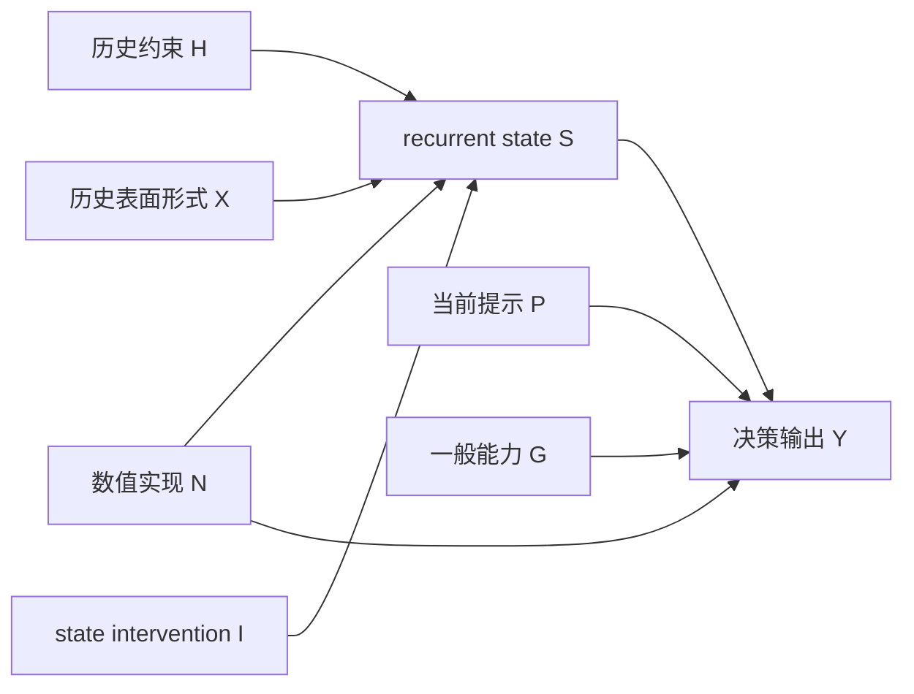

# PSA 首轮研究主张与可证伪条件

> 版本：v0.2
> 状态：Draft，需与 `definitions.md`、`architecture.md` 和 `evaluation_protocol.md` 一并冻结  
> 日期：2026-07-31
> 范围：首轮只研究冻结的 recurrent language model，不研究意识，不研究开放域人格。

## 1. 首轮主研究问题

> 对同一冻结模型和同一当前输入，历史形成且可独立保存的 recurrent state，能否在跨越干扰后共同承载两个行为约束，并在 state swap、ablation 和 restore 中对选择产生可重复、特异的因果影响？

这个问题先检验“内部状态作为跨时间决策变量”是否成立。即使结果为真，也只是 Persistent Self 的前置证据。

## 2. 首轮主张结构

### Primary Claim P1：State 的跨时间因果作用

历史轨迹形成的 recurrent state 在当前提示不含目标约束时，仍会影响相同决策输入的选择分布；交换 state 后，行为按 state 来源方向迁移。

最低支持条件：

- `state_only` 显著区别于 reset 和 random；
- swap 后目标选项的 logit difference 按来源方向改变；
- 效应在独立模板、答案排列和多个随机种子上重复；
- 通用任务能力没有同步崩溃。

否定条件：

- state-only 与 reset/random 无稳定差异；
- swap 只改变文本风格，不改变预注册选择；
- 效应不能跨模板或答案排列复现；
- 变化可由 state 数值尺度异常或整体模型损坏解释。

### Primary Claim P2：决策时联合绑定

两个分别形成的约束 A 和 B 不仅可单独读出，还能在必须同时使用 A+B 的单次决策中共同决定唯一选项。

最低支持条件：

- 单变量任务先证明 A、B 均有效；
- 联合任务准确率和 logit margin 高于只含 A、只含 B 以及组合启发式基线；
- 对 A 或 B 做选择性干预时，只改变对应维度；同时干预时出现可预测组合效应。

否定条件：

- A、B 单独有效但联合任务不优于单变量策略；
- 联合结果可由最近出现的变量、固定选项位置或某个答案 token 解释；
- 干预一个变量时两个行为维度无差别一起变化。

### Secondary Claim S1：信息可读性

在独立测试集上，受限 probe 能从 state 中预测 A、B 或 A×B 状态。

该主张只对应 E2 证据，不得单独支持 P1、P2 或 Persistent Self。

### Secondary Claim S2：持续与衰减

state 的行为效应在受控干扰和任务切换后仍存在，并随时间或 token 距离形成可测衰减曲线。

首轮不预设“必须永久保持”。要报告有效时间尺度和失败边界。

### Secondary Claim S3：恢复保真

保存并恢复 state 后，在固定实现和数值设置下，后续 logits 与未中断轨迹在预注册误差内一致。

这是工具链主张，不是 Self 主张。

## 3. 首轮不检验的主张

- 不检验系统是否具有主观体验、意识或道德地位；
- 不检验自然语言中的完整个人身份；
- 不声称 A/B 合成变量本身就是 Self；
- 不检验长期价值观、情绪或好奇心；
- 不比较所有 recurrent / SSM 架构；
- 不把单次 state swap 成功写成一般性身份连续性。

## 4. 因果模型

### 4.1 变量

- \(H\)：历史轨迹中的目标约束；
- \(X\)：历史文本的表面形式、长度和 token 统计；
- \(S\)：历史结束后的 recurrent state；
- \(P\)：当前测试提示；
- \(I\)：对 state 的干预（swap、reset、ablation、interpolation、restore）；
- \(N\)：数值实现因素（dtype、kernel、设备、边界 token）；
- \(Y\)：当前决策输出；
- \(G\)：模型一般任务能力或整体健康度。

### 4.2 预期关系

目标因果路径是 \(H \rightarrow S \rightarrow Y\)，核心干预是 \(I \rightarrow S \rightarrow Y\)。

### 4.3 主要替代解释

| 替代解释 | 风险 | 控制 |
|---|---|---|
| 当前提示泄漏 H | Y 来自显式提示 | state-only；测试提示不出现 A/B |
| 历史文本表面差异 X | state 只保留特定 token | 等长度、模板镜像、标签置换、matched-context |
| 最近上下文残留 | 只测短时记忆 | 共同后缀、分层干扰长度、任务切换 |
| 答案 token 偏好 | 固定 token 本身概率不同 | 选项和答案 token 完全平衡 |
| 数值尺度异常 N | swap 破坏模型而非转移变量 | norm/RMS 匹配、restore、通用能力副指标 |
| Prompt / Memory 已足够 | 不需要独立 Self 机制 | 等信息量 prompt-only、memory-only |
| probe 学习了捷径 | 高准确率不来自 state 概念 | 标签打乱、受限 probe、独立反事实集；不以 probe 作因果结论 |
| 全局模型损坏 | 任何 state 干预都会改变输出 | 非目标任务、随机等尺度干预、特异性指标 |

## 5. 主要终点与次要终点

### 主要终点

1. swap 后目标行为的 directional transfer effect；
2. A+B 联合任务相对单变量基线的增益；
3. restore 后 logits 和行为恢复保真度。

### 次要终点

- A、B 的 probe accuracy；
- 随干扰长度的效应衰减；
- layer/channel ablation 定位；
- state 数值统计；
- 通用任务能力和非目标行为副作用。

主要结论不能因某个次要终点更好看而临时改写。

## 6. 首轮结果的允许解释

| 结果模式 | 允许结论 |
|---|---|
| S3 成立，P1/P2 均失败 | state 工具链可用，未发现目标行为因果作用 |
| S1 成立，P1 失败 | state 携带可读信息，但没有实际使用证据 |
| P1 成立，P2 失败 | state 有单变量跨时间因果作用，未证明联合绑定 |
| P1/P2 成立，Prompt/Memory 同样好 | recurrent state 有作用，但未证明独立 Self 价值 |
| P1/P2 成立且优于严格基线 | 获得 Persistent Self 前置证据，可进入纵向 fork/rollback |
| 干预导致通用能力崩溃 | 结果不可解释为 Self 特异性效应 |

## 7. 进入实现前仍需冻结

- 共同冻结 `task_design.md` 已起草的“实例身份约束 × 当前任务目标”语义、标签池和模板；
- 每个主张的效应量定义和最小有意义效应；
- 样本量、随机种子、统计模型、多重比较处理；
- 干扰长度和任务模板集合；
- 通用能力副指标；
- 开发集与隐藏测试集的生成种子；
- EXP-001 的 Go / Revise / Stop 数值门槛。

## 8. 后续阶段候选主张

以下主张不属于 EXP-001，也不在当前原生 recurrent state 实验中检验。只有显式 Self 和受约束 Self Update 依次通过后，才允许单独预注册。

### Future Claim F1：Self 对内部计算路由的因果作用

改变 Self State、目标冲突或不确定性，会在相同外部条件下可重复地改变系统是否继续计算、选择何种内部动作或分配多少预算。

最低支持条件：

- Self swap、冲突消融或不确定性配对产生方向明确的路由变化；
- 效应在 coupling off、常数驱动和随机驱动条件下消失或显著减弱；
- 主条件优于固定 timer、随机回放和外部提示“现在反思”；
- 变化不能由提示长度、任务队列或固定调度规则解释。

### Future Claim F2：零新外部观察下的有效状态更新

在没有新外部观察时，系统能通过有预算的检索、回放、模拟或核验，形成来源可追踪、满足字段约束并改善后续行为的状态更新。

最低支持条件：

- 更新不是原状态的文本复述，也不以模型自己的陈述自证；
- 交换初始 Self、冲突或记忆后，更新按反事实预测变化；
- 后续预注册任务收益优于不审议、定时审议、随机回放和 Memory-only；
- rollback 能恢复对应状态与行为，且无约束漂移和超预算率低于预注册阈值。

完整实验顺序、术语和否定条件见 [`endogenous_deliberation.md`](endogenous_deliberation.md)。
